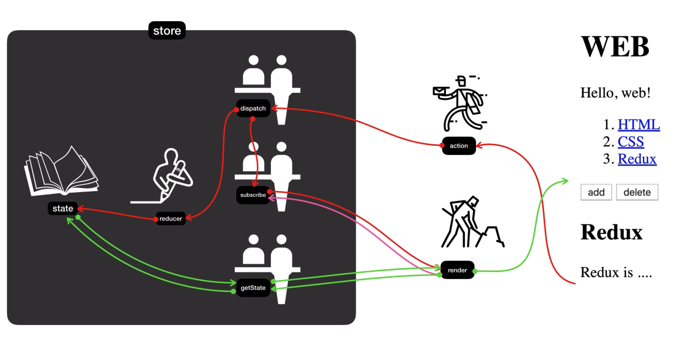
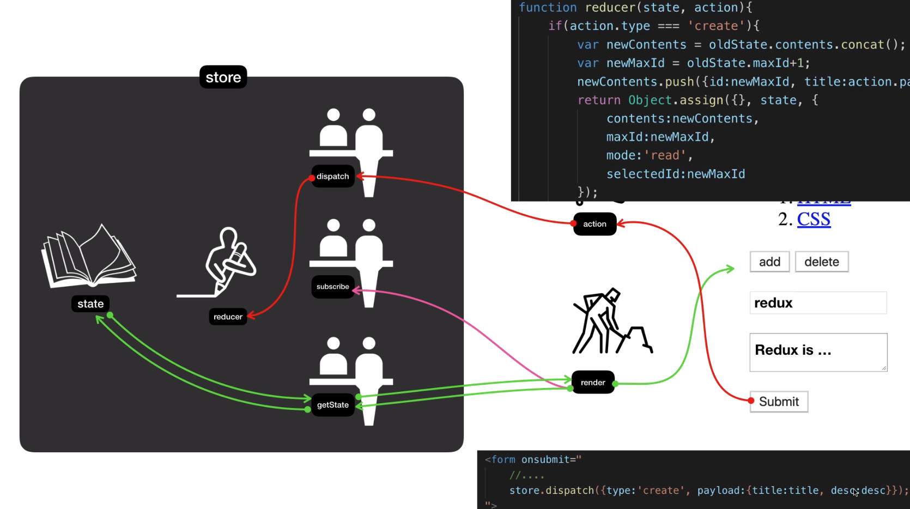
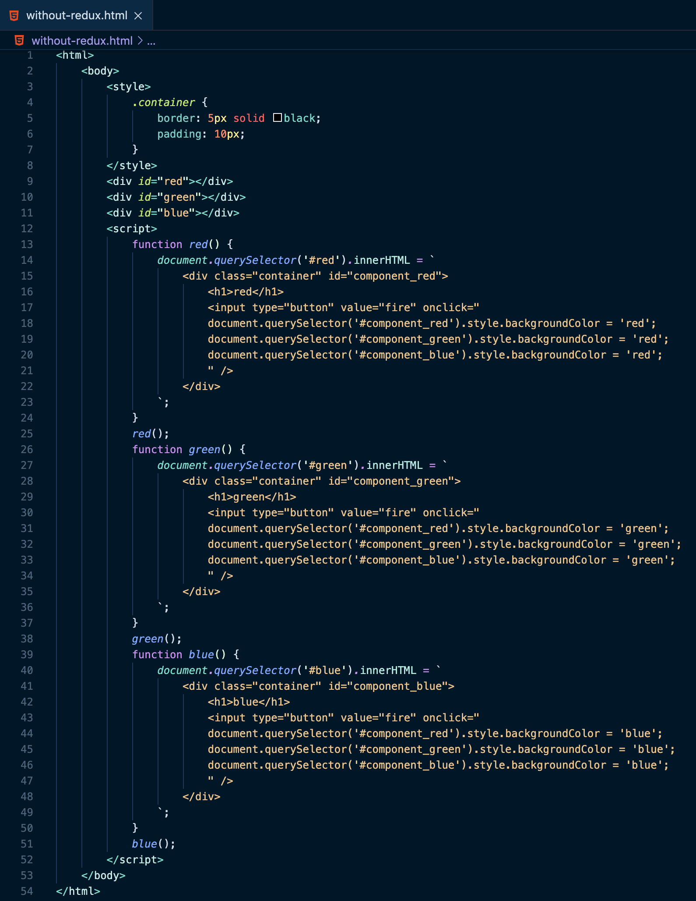

# 1. 리덕스 여행의 지도

Redux는 추상적인 도구이기 때문에 어렵게 느껴진다. 
아래 흐름을 나타낸 그림으로 쉽게 이해해보자.



## state와 render의 관계
Redux의 핵심은 store이다.
store는 정보가 저장되는 곳이다. 

### state
store의 state에 실제 정보가 저장되게 된다. 단, state에 직접 접근할 수 없다. 
- `getState`, `subscribe`, `dispatch` 함수를 통해야 한다.

store를 만들면서 `reducer`라는 함수를 만들어서 공급해줘야 한다.(중요!!)

```javascript
function reducer(oldState, action) {
   // ........
}
var store = Redux.createStore(reducer);
```

### render
render는 UI를 만들어주는 우리가 짠 코드다.
state값을 참조해서 render가 UI를 만든다고 이해하면 된다.
```javascript
function render() {
  var state = store.getState();
  // .....
  document.querySelector('#app').innerHTML = `
    <h1>WEB</h1>
    ......
  `
}
```

### subscribe
subscribe는 state값이 변경될 때마다 알아서 render함수가 호출되어 UI를 다시 렌더되도록 해준다.
즉, subscribe를 통해서 state의 값을 참조해 UI를 생성하는 것이다.
```javascript
store.subscribe(render);
```

## action과 reducer
event가 발생해 객체를 전송했을 때 action을 통해서 dispatch로 전달된다.
### dispatch
reducer를 호출해서 state의 값을 바꾼다. 이 작업이 끝나면 subscribe를 이용해서 render함수를 호출해 화면을 갱신해준다.

dispatch가 reducer를 호출할 때 두 개의 값을 전달한다.
1. 현재의 state 값
2. action 데이터



즉, **reducer는 state를 입력값으로 받고, action을 참조해서 새로운 state값을 만들어내서 return**해주는 '가공자'라고 생각하면 된다. 

<br/>

> Redux가 동작하는 전체적인 흐름의 point를 살펴보자!!
> - state가 핵심이다.
> - state를 기반으로 화면에 그려준다.
> - store의 state에 직접 접근할 수 없기 때문에 getState를 통해서 값을 가져오고 dispatch를 통해 값을 변경, subscribe를 이용해 값이 변경되었을 때 작동할 함수를 등록해준다.
> - reducer를 통해서 state의 값을 변경한다.

## Redux가 좋은 가장 중요한 이유


위 이미지 예시에서는 100개의 컴포넌트가 있을 경우 10000개의 로직이 필요하다.
위 이미지처럼 각각의 부품들이 서로 연관되어있을 경우 수없이 많은 코드가 필요하다. 복잡성이 증가하고 소프트웨어가 유연하지 못하게 된다. 
이 문제를 획기적으로 개선하기 위해 react가 존재하는 것이다.

<br/>


react의 redux를 사용함으로써 store에 데이터가 변경되었음을 알려주는 로직 하나, store로부터 변경되었다는 신호를 받아 자기 자신을 바꿔줄 로직 하나만 필요하게 된다.
따라서 위 이미지 예시를 보면, 100개의 컴포넌트가 있을 경우 200개의 로직만 필요한 것을 알 수 있다.

애플리케이션이 훨씬 단순해질 뿐만 아니라, 시간 여행도 할 수 있다.

### Redux dev tools
크롬의 개발자도구의 확장기능을 설치하면 Redux라는 항목이 추가된다. 
- [Redux dev tools 설치 방법](https://react.vlpt.us/redux/06-redux-devtools.html)

- [Redux dev tools 설명 (해당 강의 9분부터)](https://www.inflearn.com/course/redux-%EC%83%9D%ED%99%9C%EC%BD%94%EB%94%A9/lecture/34746?tab=curriculum)

## Redux가 없다면



위 이미지는 redux를 사용하지 않은 코드이다. 컴포넌트(`<div>`)가 늘어날 수록, 함수 역시 개수가 늘어나는 것을 볼 수 있다.
