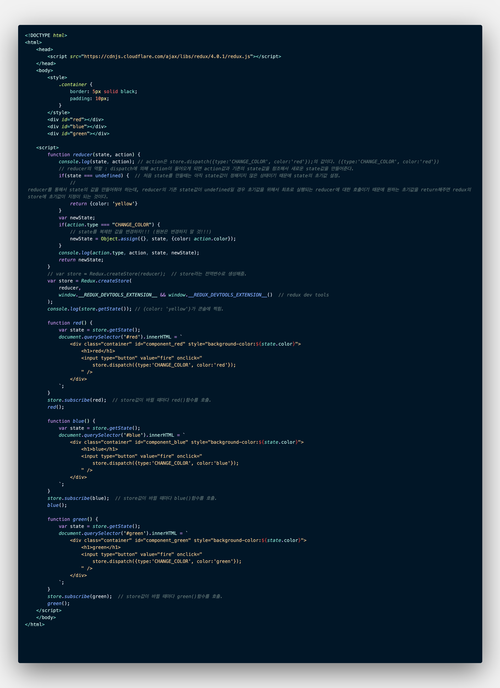

# 2. Redux의 적용
[redux 공식 사이트](https://redux.js.org/)에서 npm을 이용해 설치하거나, 브라우저에서 [redux cdn](https://cdnjs.com/libraries/redux/4.0.1)을 검색해 사용하면 된다.
## store 생성
```javascript
function reducer(state, action) {
  // reducer의 역할 : dispatch에 의해 action이 들어오게 되면 action값과 기존의 state값을 참조해서 새로운 state값을 만들어준다.
  if(state === undefined) {  
  // 처음 state를 만들때는 아직 state값이 정해지지 않은 상태이기 때문에 state의 초기값 설정.
    // reducer를 통해서 state의 값을 만들어줘야 하는데, reducer의 기존 state값이 undefined일 경우 초기값을 위해서 최초로 실행되는 reducer에 대한 호출이기 때문에 원하는 초기값을 return해주면 redux의 store에 초기값이 지정이 되는 것이다.
    return {color: 'yellow'}
  }
}

var store = Redux.createStore(reducer);  // store라는 전역변수로 생성해줌.
console.log(store.getState()); // {color: 'yellow'}가 콘솔에 찍힘.
```

**reducer**의 역할
- dispatch에 의해 action이 들어오게 되면 action값과 기존의 state값을 참조해서 새로운 state값을 만들어준다.

`if(state === undefined) {}`
- 처음 state를 만들때는 아직 state값이 정해지지 않은 상태이기 때문에 state의 초기값 설정해야 한다.
- reducer를 통해서 state의 값을 만들어줘야 하는데, reducer의 기존 state값이 undefined일 경우 초기값을 위해서 최초로 실행되는 reducer에 대한 호출이기 때문에 원하는 초기값을 return해주면 redux의 store에 초기값이 지정이 되는 것이다.

## reducer와 action을 이용해서 새로운 state 값 만들기
state를 변경하기 위해서는 action을 만들어야 한다. action을 dispatch에게 제출하면 dispatch가 reducer를 호출하게 된다. 이때, 이전의 state값과 action의 값을 동시에 준다. reducer함수가 state값과 action의 값을 분석해서 state의 최종적인 값을 return하게 된다.

reducer에서 return되는 값은 원본을 바꾸는 것이 아니라, 이전에 있던 값을 복제한 결과를 return해야만 redux를 사용하는 여러 효율적인 기능들을 최대로 사용할 수 있다.

### state 원본을 변경하지 말자!!!
state의 원본값을 변경하는 것이 아니라 state를 복제한 값을 변경하자. 
원본값을 변경할 경우 UNDO, REDO, module reloading 등의 시간 여행이라는 장점을 이용할 수 없게 된다. (예측 가능한 동작을 할 수 있도록 할 수 없게 된다.)

#### 객체 복사
```javascript
Object.assign({}, {name:'ej'}, {city:'seoul'});
// {name: "ej", city: "seoul"}
```
`Object.assign()`의 **첫 번째 인자로 빈 객체**를, **두 번째 인자로 복사하고자 하는 값**을 넣어준다. 

빈 객체에 두 번째로 넣은 값이 복사되고, 만약 세 번째 값도 있을 경우 두 번째 값이 복사된 객체에 세 번째 값도 복사되게 된다.

### state의 변화에 따라서 UI 반영하기
redux를 사용함으로써 디커플링시킬 수 있다. 즉, 컴포넌트 간의 의존성을 낮추는 것이다.


## Redux 선물: 시간여행과 로깅
### [redux dev tools](https://github.com/zalmoxisus/redux-devtools-extension)
- time traveling

복잡한 애플리케이션일 경우 문제가 발생했을 때, 어떠한 맥락 속에서 문제가 발생했는가를 파악하는 것이 어려워진다. 이럴 경우에 redux dev tools를 사용하면 보다 편하게 문제를 파악할 수 있다.


### 불변 (immutable)
state 원본에 대해서 변경하면 안된다.
action에 의해서 state가 변경될 때마다, 이 바뀌는 각각의 데이터들은 서로 완전히 독립된 데이터이어야 한다는 것이다.

### 단일 store
redux는 하나의 store만 유지한다. 하나의 store는 reducer를 통해서 가공되기 때문에, 애플리케이션의 상태가 궁금할 경우 reducer를 이용하면 된다.
```javascript
function reducer(state, action) {
  ....
  .....
  console.log(action.type, action, state, newState);
  .....
}
```

<br/>

***

<br/>

## [Redux 없이 짠 코드](https://github.com/EunJaePark/React/blob/master/Redux/%EA%B0%95%EC%9D%98%EC%A0%95%EB%A6%AC/1_%EB%A6%AC%EB%8D%95%EC%8A%A4%20%EC%97%AC%ED%96%89%EC%9D%98%20%EC%A7%80%EB%8F%84.md#redux%EA%B0%80-%EC%97%86%EB%8B%A4%EB%A9%B4)를 Redux를 이용해서 다시 짜보자.


