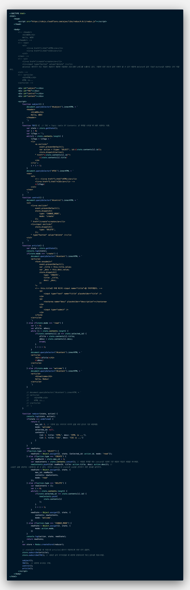

# 3. 실전 Redux
## 정적인 웹페이지 만들기
delete는 페이지가 아닌 작업의 개념이기 때문에 자동화된 프로그램이 a태그를 누를수도 있다. 이렇게 되면 의도치 않게 삭제가 될 수 있기 때문에 delete와 같은 기능은 button을 사용하는 것이 적절하다. 
```html
<ul>
  <li><a href="/create">create</a></li>
  <li><input type="button" value="delete" /></li>
  // delete는 페이지가 아닌 작업의 개념이기 때문에 자동화된 프로그램이 a태그를 누를수도 있다. 
  // 이렇게 되면 의도치 않게 삭제가 될 수 있기 때문에 delete와 같은 기능은 button을 사용하는 것이 적절하다.
</ul>
```

## 부품화
```html
<!DOCTYPE html>
<html>
  <body>
    <header>
      <h1>WEB</h1>
      Hello, WEB!
    </header>        
  </body>
</html>
```
위 태그를 아래 코드처럼 부품화를 시켜줌으로써, 만약 수많은 태그가 생길 경우 보다 편리하게 작업이 가능해진다.
```html
<!DOCTYPE html>
<html>
  <body>
    <div id="subject"></div>
    <script>
      function subject() {
        document.querySelector('#subject').innerHTML = `
          <header>
            <h1>WEB</h1>
            Hello, WEB!
          </header>
        `;
      }
      subject();
    </script>
  </body>
</html>
```
**가독성**이 높아지고, `subject()`(위 코드의 경우)를 여러 번 **재사용**하기에도 용이하다.
- 코드를 하나하나 보지 않고 부품들을 사용하는 코드들만 봐도 이름을 보고 어떤 내용의 코드일지 예상이 가능하게 된다.

부품화한 코드를 Redux와 함께 사용해보자.

## store 생성과 state 사용하기
Redux를 사용하기 위해서는 store를 생성해야한다.

각각의 구성요소가 store에서 state를 가져온 다음에 state 값을 기반으로 HTML 코드를 생성해주면 state에 따라서 만들어지는 웹페이지를 생성할 수 있게 된다.

```javascript
function TOC() {  // TOC = Topic table Of Contents: 글 목록을 나타낼 때 보통 사용하는 이름.
   var state = store.getState();
   var i = 0;
   var liTags = '';
   while(i < state.contents.length) {
      liTags = liTags + `
      <li>
        <a href="${state.contents[i].id}">${state.contents[i].title}</a>
      </li>`;
      i = i + 1;
   }
   document.querySelector('#TOC').innerHTML = `
   <nav>
      <ol>
         <!-- <li><a href="1.html">HTML</a></li>
         <li><a href="2.html">CSS</a></li> -->
         ${liTags}
      </ol>
   </nav>
   `;
}
            
function reducer(state, action) {
   if(state === undefined) {
      return {
         contents: [
            {id: 1, title: 'HTML', desc: 'HTML is ...'},
            {id: 2, title: 'CSS', desc: 'CSS is ...'}
         ]
      }
   }
}
var store = Redux.createStore(reducer);
```
## action을 dispatch를 통해서 전달하기
store의 state값을 바꾸기 위해서는 action을 발생시키고, dispatch를 통해서 reduce를 실행시켜 새로운 state값을 뱉어낸다. state값이 바뀌면 UI가 업데이트 된다.

## subscribe를 통해서 자동 갱신 되도록 처리

## 글생성 기능 구현

## 글삭제 기능 구현


<br/>

***

<br/>

# 4. 수업을 마치며
Redux는 React와 단짝이다. 

오늘날 Redux는 독립적인 상태관리저장소로 발전하고 있다. (React에서만 사용하는 것이 아니란 말!)

Redux의 미들웨어를 사용하면 편리하게 개발이 가능하다.
- Ecosystem

Javascript Immutability(불변성)에 대해 더 공부해보면 좋을 것이다.
- 예기치 못한 상태의 변화로 발생하는 오류를 예방할 수 있다.
- 각각의 상태가 독립적이기 때문에 이 상태들을 버전관리하게 되면 undo/redo, 시간여행 등의 고급작업을 쉽게 할 수 있다.
- 다만, 데이터를 불변하게 유지하는 과정은 쉽지 않다.
- IMMUTABLE 라이브러리.

***

### 완성 코드
> [Redux] - main.html


