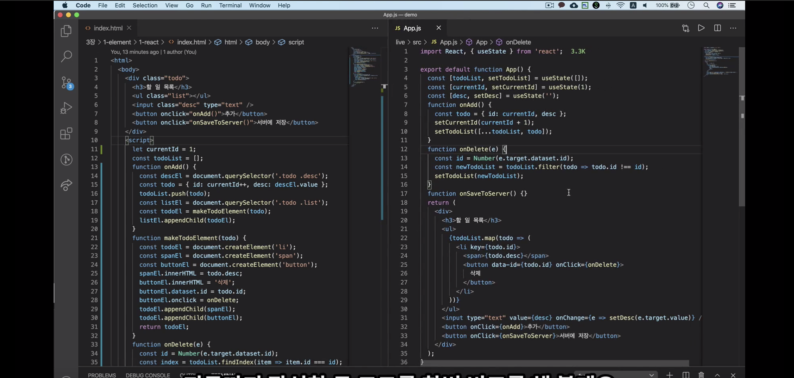

# 2.  중요하지만 헷갈리는 리액트 개념 이해하기
`$ npx create-react-app`명령어를 이용해 프로젝트 생성시 `npm ERR! cb() never called!`라는 에러가 발생했다. 이 에러 해결을 위해 [블로그](https://nightstudy.tistory.com/114)를 참고했다.
> `$ sudo npm cache verify`
`$ sudo npm cache clean --force`
후 다시 설치


## HTML코드와 React 코드를 비교해보자.


- 같은 코드를 작성했을 때, 리액트 코드는 이벤트 핸들러에서 데이터를 변경하는 작업만 하고있다. 반면에 html코드를 보면 데이터를 변경하는 코드도 있지만 UI코드도 섞여있는 것을 볼 수 있다.
>리액트에서는 비즈니스 로직과 UI코드가 분리되어 있다.
>즉, 리액트에서 UI코드는 jsx부분에서 한 번만 작성을 해주면 그 이후에는 신경쓰지 않아도 된다.
- html코드에서는 화면을 어떻게 그려야 하는지 자세하게 코드에 나와있지만, 리액트 코드에서는 화면에 무엇을 그리는지를 나타내고 있다. 데이터를 기반으로 UI가 어떤 모습이어야 하는지를 나타내는 것이다.
> html은 명령형 프로그래밍. 리액트는 선언형 프로그래밍
- html 코드는 처음 처음 시작은 보이지만 그 이후에 어떤 모습으로 UI가 변하는지 한눈에 보이지 않는다. 반면에 리액트 코드는 UI가 어떤 모습일지 한 눈에 보인다.
- html코드는 돔을 직접 수정하면서 화면을 어떻게 그리는지 구체적으로 나타낸다. 돔 api를 이용하고 있는 것인데, 상당히 구체적이기 때문에 돔 환경이 아닌 곳에서는 사용하기가 힘들다. 반면에 리액트 코드에서는 무엇을 그리는지만 나타내고 있기 때문에 다양한 방식으로 그릴 수 있다. 돔 환경뿐만 아니라 모바일 네이티브의 UI도 표현할 수 있는 것이다.
> 선언형 프로그래밍은 명령형 프로그래밍보다 추상화 단계가 높다고 할 수 있다. 추상화 단계가 높을수록 비지니스 로직에 조금 더 집중할 수 있다는 장점이 있다.

✔️ **리액트에서는 UI코드는 선언형으로 작성을 해놓고, 이벤트 핸들러에서는 데이터만 수정을 하게 되면 리액트가 자동으로 UI를 렌더링을 해준다.**

## 컴포넌트의 속성값과 상태값
리액트 컴포넌트에서는 UI데이터를 속성값이나 상태값으로 관리를 해야한다.

- 속성값이 변경될 때만 컴포넌트가 렌더링되게 하려면 `React.memo`를  사용하면 된다.

- 같은 컴포넌트를 여러 번 사용할 수도 있다. 같은 컴포넌트라고 하더라도 각각의 메모리 공간이 있기 때문에, 같은 컴포넌트를 여러번 사용해도 각각의 상태값을 유지할 수 있다.

- 속성값은 불변 변수이지만, 상태값은 불변 변수가 아니다. 하지만 상태값도 불변 변수로 관리하는 것이 좋다. 
	- 부모컴포넌트와 연결된 컴포넌트의 상태값을 수정하고 싶을 경우, 해당 값을 가진 부모 컴포넌트에서 관리하는 상태값 변경 함수를 이용해야 한다.
	- 불변 변수로 관리하면 코드의 복잡도도 낮아지는 장점이 있다.

- 객체를 불변 변수로 관리하는 방법은 **전개 연산자**를 이용하는 것이다.


## 컴포넌트 함수의 반환값
- 리액트 요소(`<div>`....), 문자열, 컴포넌트, 숫자, 배열 등을 반환이 가능하다.
```javascript
import React from 'react';
import Counter from './Counter';

function App() {
	return (
		<div>
			<Counter />
		</div>
	);
}

function App() {
	return <div>안녕하세요</div>;
}

function App() {
	return '안녕하세요'
}

function App() {
	return <Counter />;
}

function App() {
	return 123;
}

function App() {
	return ['안녕', '하세요'];
}

function App() {
	return [<p key={1}>안녕</p>, <p key={1}>하세요</p>];
}
// 배열로 반환할 때는 리액트 요소가 항상 key값을 갖고 있어야 한다.
// key는 렌더링을 효율적으로 하기 위해 필요한 값.

function App() {
	return (
		<React.Fragment>
			<p>안녕</p>
			<p>하세요</p>
		</React.Fragment>;
	)
}
// Fragment는 key값이 없어도 된다.
// 요소의 순서가 key역할을 하기 때문이다.
// 따라서, 여러개의 값을 반환할 때 유용하게 사용할 수 있다.

// Fragment는 축약형으로 입력할 수 있다.
function App() {
	return (
		<>
			<p>안녕</p>
			<p>하세요</p>
			{null}
			{false}
			{true}
		</>;
	)
}
// <> 속에 아무것도 입력하지 않으면 Fragment로 동작을 한다.
// 또한, null이나 boolean값들도 반환이 가능하다. 하지만 이 값들은 무시가 되어 화면에 출력되지 않는다.

export  default  App;
```
<br/>

**boolean**값은 **조건부 렌더링**을 할 때 유용하게 사용될 수 있다.
```javascript
{count.value  >  0  &&  <Title  title={`현재 카운트: ${count.value}`}  />}
```
- count.value > 0 && 를 줘서 조건만족시에만 렌더링이 되도록 해줬다.
- &&을 이용하면 조건부 렌더링이 된다. &&의 왼쪽에 있는 조건이 모두 만족되어야만 뒤에 있는 것이 렌더링된다.


### 리액트 portal 반환
컴포넌트에서는 리액트 portal을 반환할 수가 있다.
- `public` - `index.html`파일의 `<div id="root"></div>`외에도 다른 <div>로 연결이 가능하다.
- 리액트 protal을 하기 위해서는 react-dom에 있는 함수를 사용해야 한다.

```html
<!-- index.html -->

<div  id="something"></div>
```
```javascript
// App.js

import React from  'react';
import ReactDOM from  'react-dom';
import Counter from  './Counter';

function  App() {
	return (
		<>
			<p>안녕</p>
			<Counter  />
			{ReactDOM.createPortal(
				<div>
					<p>안녕하세요</p>
					<p>리액트 portal을 연습하고 있습니다.</p>
				</div>,
			document.getElementById('something'),
			)}
		</>
	);
}

export  default  App;
```
