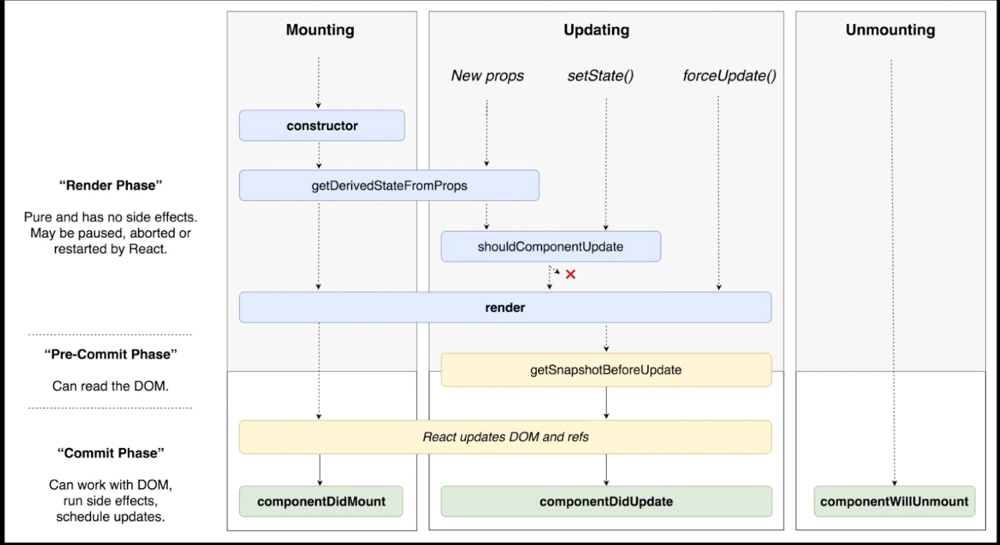

# LifeCycle API
LifeCycle API는 **생명주기**이다.
컴포넌트가 브라우저 상에서 **나타날 때**, **업데이트 될 때**, **사라질 때** 중간중간 과정에서 어떤 작업을 하고 싶을 경우 사용한다.



### Mounting
**컴포넌트가 브라우저 상에 나타날 때.**
컴포넌트가 처음 브라우저 상에 나타날 때 가장 먼저 실행되는 함수이다.

**constructor**
컴포넌트가 가지고 있을 **state의 초기 설정**, **컴포넌트가 만들어지는 과정에서 미리 행해져야 할 작업**이 있을 경우 **constructor**에서 처리한다.

**getDerivedStateFromProps**
props로 받은 값을 state에 동기화 시키고 싶을 경우에 사용한다.
Mounting, Updating 둘 다에서 사용된다.

**render**
어떤 DOM을 만들게 될지, 내부에 있는 태그들에는 어떤 값을 전달해주게 될지를 정의해준다.

**componentDidMount**
실제로 브라우저 상에 나타나게 되면 호출된다.주로 외부 라이브러리(차트 라이브러리 등..)를 사용하게 될 때, 특정 DOM에 차트를 그려주세요라는 식의 코드를 작성할 수 있다.
혹은 네트워크 요청, API, ajax 요청이 필요할 경우에도 **componentDidMount**에서 처리한다.
컴포넌트가 나타나고 몇 초 뒤에 어떤 동작을 하고 싶을 경우에도 사용한다.
즉, 우리가 만든 컴포넌트가 브라우저에 나타난 시점에 어떠한 작업을 하겠다는 것을 명시해주는 것이다.

<br/>

### Updating
**컴포넌트의 props, state가 바뀌었을 때.**

**shouldComponentUpdate**
```javascript
shouldComponentUpdate(nextProps, nextState) {}
```
> 다음 받아올 props와 다음 받아올 state값을 파라미터로 받는다.

컴포넌트가 **업데이트 되는 성능을 최적화**시키고 싶을 때 사용한다. 
만약, 부모 컴포넌트가 리렌더링이 되면 자식 컴포넌트도 전부 리렌더링이 진행된다.(실제 화면에는 변경된 부분만 다시 렌더링되지만, 그 전에  가상 DOM에는 모든 부분이 리렌더링되는 것이다. 리렌더링된 가상DOM과 실제DOM을 비교해서 달라진 부분만 그려내는 것이다.) 
하지만 이 작업이 불편해질 경우가 있다. 만약 컴포넌트의 수가 몇 백, 몇 천개일 경우 **가상 DOM에서도 다시 그려주는 것을 줄여줘**야 성능을 최적화할 수 있기 때문이다. 
따라서, shouldComponentUpdate에서 **true**값과 **false**값을 반환해 줄 수 있다. true값을 반환받았을 경우에만 렌더링을 계속 진행하고, false값이 반환될 경우에는 렌더링을 멈추게 하는 것이다.
즉, **virtual DOM에도 렌더링을 다시 할지 말지를 결정**하는 것이다.
> `shouldComponentUpdate`함수를 사용하지 않으면 기본적으로 `true`를 리턴한다.

**getSnapShotBeforeUpdate**
렌더링을 한 다음에 렌더링을 한 결과물이 브라우저상에 반영되기 바로 직전에 호출되는 함수다.
렌더링 후 업데이트 되기 바로 전의 스크롤 위치, 해당 DOM의 크기 등을 사전에 가져오고 싶은 상황에서 사용한다.

**componentDidUpdate**
컴포넌트가 업데이트 되었을 때 호출되는 함수다.
state가 바뀌었을 때 어떤 작업을 하겠다는 것을 명시할 때 사용한다.

> 예)
> **getSnapShotBeforeUpdate**를 이용해 업데이트 되기 직전의 스크롤 위치와 스크롤 크기를 가져와서 이 값들을 return하고, **componentDidUpdate**의 세번째 파라미터로 받아와서 이 값에 따라 보고있는 화면의 스크롤 위치를 설정함으로써 우리가 보고있던 위치를 그대로 유지하게 할 수 있다.


<br/>

### Unmounting
**컴포넌트가 브라우저 상에서 사라질 때.**

**compoentWillUnmount**
컴포넌트가 사라지는 과정에서 호출되는 함수다. **componentDidMount**에서 설정한 리스너를 없애주는 작업을 해줄 때 사용한다.

<br/>

## LifeCycle API를 코드를 통해 알아보자
[https://codesandbox.io/s/xl313zyrkw](https://codesandbox.io/s/xl313zyrkw)에서 실습해보자.

특정 DOM에 작업하고 싶을 경우에는 `ref`를 사용한다. DOM에 id를 붙여주는 것과 비슷하다. DOM에 대한 레퍼런스를 바로 가져올 수 있다.
```javascript
<div  ref={(ref) => (this.myDiv = ref)}>
...
</div>
```

**componentWillReceiveProps**
v16.3부터 사용되지 않고있다.
대신 `getDerivedStateFromProps()`가 생겼다.

**getDerivedStateFromProps( )**
getDerivedStateFromProps는 static 값으로  넣어줘야 한다.
`nextProps`와 `prevState`를 파라미터로 받아와야 한다.
- `nextProps` : 다음으로 가져올 props 값.
- `prevState` : 현재 업데이트 되기 전의 상태를 가져옴.

<br/>

## 컴포넌트에 에러 발생
**componentDidCatch**
에러가 발생하는 컴포넌트의 **부모 컴포넌트에서 사용**해야 한다.
우리가 실수로 잡지 못했던 에러들을 잡을 때 사용한다.
```javascript
componentDidCatch(error, info) {
  console.log(error);
  console.log(info);
}
```
- `error` : 어떤 에러가 발생했는지 알려줌.
- `info` : 에러가 어디서 발생했을지 알려줌.

에러가 발생하면 브라우저 화면에 에러사항만 뜬다. 이렇게 되면 사용자 입장에서 에러만 보이기 때문에 이를 방지하고자 `state`에 `error`값을 입력해준다.
```javascript
import React, { Component } from 'react';
import MyComponent from './MyComponent';

class App extends Component {
  state = {
    counter: 1,
    error: false
  };

  componentDidCatch(error, info) {
    this.setState({
      error: true
    });
    //  API를 통해서 서버로 오류 내용 날리기 등의 기능을 작성할 수 있다.
  }

  constructor(props) {
    super(props);
    console.log('constructor');
  }
  componentDidMount() {
    console.log('componentDidMount');
    // console.log(this.myDiv.getBoundingClientRect()); // 특정 DOM의 크기를 볼 수 있다.
  }
  handleClick = () => {
    this.setState({
      counter: this.state.counter + 1
    });
  };
  render() {
    if (this.state.error) {
      return <div>에러가 났어요!</div>;
    }
    return (
      <div>
        {this.state.counter < 10 && <MyComponent value={this.state.counter} />}
        <button onClick={this.handleClick}>Click Me</button>
      </div>
    );
  }
}

export default App;

```


*** 
- [LifeCycle API 참고 문서](https://react-anyone.vlpt.us/05.html) 


