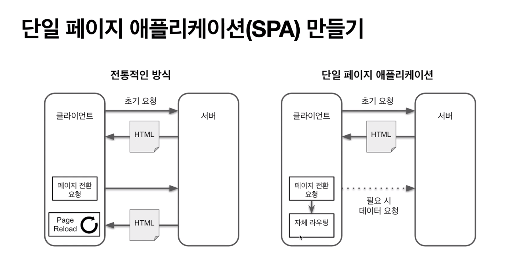

(2020. 12. 08(화))
## 리액트란?
- 리액트는 UI기능만 제공된다. 따라서 전역 상태관리, 라우팅, 빌드 시스템 등을 개발자가 직접 구축해야 한다.
- 자유도가 높지만 개발 환경을 직접 구축해야 하기 때무네 번거롭다. 
---> 'create-react-app'을 이용해 번거로움을 줄일 수 있다.

- 장점: 가상돔을 통해 랜더링 성능을 크게 향상시킬수 있다.
( '가상돔'이란 이전 UI 상태를 메모리에 유지해서 변동된 부분만 업테이트 하는 것이다. )

## 바벨이란?
- 자바스크립트 코드를 변환해주는 컴파일러
- 초기에 ES6 문법을 ES5문법으로 변환해주는 용도로 많이 사용되었었다.
- 최근에는 코드에서 주석을 제거, 코드를 압축하는 용도로 사용되기도 한다.
- 리액트에서는 jsx문법을 createElement함수를 호출하는 코드로 변환하기 위해 바벨을 사용하기도한다.

## jsx문법
- htmle에서는 class라는 이름으로 클래스명을 입력할 수 있지만, 자바스크립트에서는 클래스가 예약어이기 때문에 className처럼 다른 이름으로 입력을 해야한다.
- 컴포넌트도 html의 다른 태그와 같이 비슷한 방식으로 입력할 수 있다.
- 속성값은 문자열은 `' '`로 입력하면 되지만, 문자열이 아닌 것은 `{ }`(중괄호)로 입력해야 한다.
- 자바스크립트에서는 `-`(하이픈)이 마이너스로 인식이 되기 때문에, `style`에서 `marginTop`등을 입력할 때 카멜케이스로 작성해줘야 한다.
```javascript
<div className="box">
   <Title text="hello world" width={200}/>
   <button onClick={() =>{}}>좋아요</button>
   <a href="/home" style={{ marginTop: '10px', color: 'red' }}>
      홈으로 이동
   </a>
</div>
```

- jsx문법은 자바스크립트 표준이 아니기 때문에, 당연하게도 브라우저에서 실행하면 에러가 발생한다.
	```
	Uncaught SyntaxError: Unexpected token '<'
	```
	- 이 에러가 발생하지 않도록 바벨을 이용해 createElement코드로 변환을 해야 한다.
	- babel을 설치하기 위해 npm을 사용해야 하는데, npm으로 패키지를 관리할 때는 package.json이 필요하다.  
	- `$ npm init -y`을 터미널에 입력해 package.json파일을 생성하면 된다.
	- `$ npm install @babel/core @babel/cli @babel/preset-react`을 입력해 babel을 이용할 수 있도록 설치한다.
		- `@babel/core` : 바벨의 핵심 기능을 가지고 있는 패키지.
		- `@babel/cli` : cli에서 사용할 바이너리가 들어 있다.
		- `@babel/preset-react` : 리액트를 위한 플러그인들을 모아놓은 것.
			- 플러그인: 하나의 변환하는 기능
			- 프리셋: 여러 개의 플러그인을 모이 놓은 것. 특정 목적을 위해 하나의 프리셋으로 묶어주는 것이다.
	- `$ npx babel --watch src --out-dir . --presets @babel/preset-react`명령어를 이용해 자바스크립트 파일을 src폴더로 옮겨지게 하자. 
		- 파일이 변경될 때마다 자동으로 파일을 컴파일 해주게 된다.


## 웹팩
- 다양한 기능 제공
	- 파일 내용을 기반으로 파일 이름에 해시값 추가 => 효율적으로 브라우저 캐싱 이용
	- 사용되지 않은 코드 제거
	- 자바스크립트 압축
	- JS에서 CSS, JSON, 텍스트 파일 등을 모아 일반 모듈처럼 불러오기
	- 환경 변수 주입
- 웹팩을 사용하는 가장 큰 이유
	- 모듈 시스템(ESM, commonJS)을 사용하기 위해.
		- ESM : ES6에서 추가 됨.
		- commonJS : 노드에서 많이 사용.
- 요즘 브라우저는 ESM을 지원한다.
	- 하지만, 오래된 브라우저나 대부분의 많은 오픈 소스는 commonJS로 작성되어있다.

- `type="module"`이라고 type을 설정하면 ESM으로 스크립트를 실행할 수 있다.
	```html
	<script type="module" src=""></script>
	```
<br/>

- `$ npm install webpack webpack-cli react react-dom`명령어를 이용해 웹팩에 필요한 `webpack`, `webpack-cli`, `리액트 패키지`를 설치해준다.
- 설치 후 `$ npx webpack`를 실행하면 `dist`폴더 안에 번들링 된 파일들이 생성된다.

## create-react-app
**리액트 개발환경을 구축**해주는 도구
- 리액트 개발환경을 직접 구축하려면 많은 지식과 노력이 필요하다.
	- webpack, babel, jest, eslint, polyfill, HMR, CSS 후처리 등등....
- 따라서, create-react-app을 사용하면 위의 개발환경들을 자동으로 구축해주기 때문에 유용하다.
<br/>

**`$ npx create-react-app 프로젝트이름`**
- 터미널에 위 명령어를 입력해 프로젝트를 생성해준다.
- 추후 create-react-app의 버전이 업그레이드 될 경우, `package.json`파일의 `"react-scripts": "4.0.1"`만 변경해주면 버전이 변경된다.

- 프로젝트 생성 후 `$ npm start`로 실행시켜주니 에러가 발생.
	- [블로그 참고](http://tlog.tammolo.com/blog/npm-react-module/)해서 해결.
		- `.env`파일 생성 후, `SKIP_PREFLIGHT_CHECK=true`내용 넣어줘서 다시 `$ npm start`해보니 VSCode에서 chrome를 제어해도 괜찮겠냐는 알림 뜬 후 실행되었다.

<br/>

- img파일이나 css파일은 자바스크립트에서 import해서 사용하는 것이 좋다. 
	- 경로에 해시 값이 들어가기 때문에 브라우저 캐싱을 효율적으로 할 수 있다.
- img뿐만 아니라 데이터를 다룰 때는 `json`파일도 사용할 수 있다.
	- 데이터는 페이지가 렌더링 될때부터 받아오는 것보다, 필요할 때 받아오도록 작성하자.


<br/>

### `start`
- mac: `$ npm start`
- window: `set HTTPS=true && npm start`
> `$ npm start`로 시작을 하려는데 에러가 발생했다.
>```
>.> todolist@0.1.0 start /Users/eunjae/Desktop/github/React/todolist
>.> react-scripts start
>
>
>There might be a problem with the project dependency tree.
>It is likely not a bug in Create React App, but something you need to fix locally.
>
>The react-scripts package provided by Create React App requires a dependency:
>
 > "webpack": "4.44.2"
>
>Don't try to install it manually: your package manager does it automatically.
>However, a different version of webpack was detected higher up in the tree:
>
  >/Users/eunjae/node_modules/webpack (version: 5.10.0) 
>
>Manually installing incompatible versions is known to cause hard-to-debug issues.
>
>If you would prefer to ignore this check, add SKIP_PREFLIGHT_CHECK=true to an .env file in your project.
>That will permanently disable this message but you might encounter other issues.
>
>To fix the dependency tree, try following the steps below in the exact order:
>
>  1. Delete package-lock.json (not package.json!) and/or yarn.lock in your project folder.
>  2. Delete node_modules in your project folder.
>  3. Remove "webpack" from dependencies and/or devDependencies in the package.json file in your project folder.
>  4. Run npm install or yarn, depending on the package manager you use.
>
>In most cases, this should be enough to fix the problem.
>If this has not helped, there are a few other things you can try:
>
>  5. If you used npm, install yarn (http://yarnpkg.com/) and repeat the above steps with it instead.
>     This may help because npm has known issues with package hoisting which may get resolved in future versions.
>
>  6. Check if /Users/eunjae/node_modules/webpack is outside your project directory.
>     For example, you might have accidentally installed something in your home folder.
>
>  7. Try running npm ls webpack in your project folder.
>     This will tell you which other package (apart from the expected react-scripts) installed webpack.
>
>If nothing else helps, add SKIP_PREFLIGHT_CHECK=true to an .env file in your project.
>That would permanently disable this preflight check in case you want to proceed anyway.
>
>P.S. We know this message is long but please read the steps above :-) We hope you find them helpful!
>
>npm ERR! code ELIFECYCLE
>npm ERR! errno 1
>npm ERR! todolist@0.1.0 start: `react-scripts start`
>npm ERR! Exit status 1
>npm ERR! 
>npm ERR! Failed at the todolist@0.1.0 start script.
>npm ERR! This is probably not a problem with npm. There is likely additional logging output above.
>
>npm ERR! A complete log of this run can be found in:
>npm ERR!     /Users/eunjae/.npm/_logs/2020-12-10T10_47_38_549Z-debug.log
>eunjaeui-MacBookPro:todolist eunjae$ 
>```
> 에러 해결을 위해 [해당 블로그](https://dltmdwls154.medium.com/react-npm-start-error-38987cac1d08)를 참고했다.
>> react 디랙토리에 .env 파일 생성후 SKIP_PREFLIGHT_CHECK=true 코드를 붙여넣으니 정상 실행되었다.

### `build`
- `$ npm run build`
- 배포할 때 사용.
- build하면 정적파일이 생성된다.
- 서버에서는 생성된 build파일을 정적파일로 서비스한다.
	- 별도의 서버에 애플리케이션을 실행하지 않기 때문에 서버사이드 렌더링으로 동작할 수 없다.
- `$ npx serve -s build`명령어로 정적파일을 서비스하면 브라우저에서 화면이 보인다.
- build를 하게 되면 작은 img의 경우에는 자바스크립트 안에 이미지의 내용이 내장된다.
	- HTTP요청 횟수를 줄이기 위한 목적.
	- 좀 더 빠르게 이미지를 보여줄 수 있기 때문에.

**React Developer Tools**
- 리액트 개발할 때 많은 다양한 기능들이 있기 때문에, 다운로드 받아놓으면 유용하다.

### `test`
1. `$ npm test`
2. __tests__폴더를 생성하면 해당 폴더 아래에 있는 모든 파일이 teste된다.
- 위 두 방법 중 `$ npm test`를 더 추천.

### `eject`
- `$ npm run eject`
- react-scripts를 사용하지 않고 모든 설정 파일을 추출하는 명령어.
- create-react-app을 기반으로 직접 개발 환경을 구축하고 싶을 때 사용한다.
- 하지만 추출하면 수동으로 설정파일을 수정해야 한다. 
	- 따라서, 꼭 필요한 경우가 아니라면 관리측면에서 추출하지 않는 것이 좋다.


<br/>

***

- create-react-app에는 core-js가 내장되어 있기 때문에 import만 해서 사용하면 된다.

### 환경변수 관리
- 환경변수를 커맨드 라인에서 입력할 수도 있다.
	- `REACT_APP_`로 시작을 해야한다.
	- mac: `REACT_APP_API_URL=api.myapp.com npm start`
	- window:  `set "REACT_APP_API_URL=api.myapp.com" && npm start`

- 환경변수가 많아지면 **.env**파일로 관리하는게 좋다.


## css 작성 방법 결정하기
```
- 일반적인 CSS파일로 작성하는 방법을 극복하기 위해 css-module로 작성해보자.
- Sass로 작성
- css-in-js로 작성
```

### 일반적인 CSS파일로 작성
- **일반적인 CSS파일로 작성**할 경우 이름이 충돌하면 마지막에 선언된 CSS로 적용된다.

### css-module
- 이런 충돌 문제를 해결하기 위해 **css-module**로 작성하면 된다.
	- css파일명을 `이름.module.css`로 저장해주고, 해당 js파일에서 import할 때, `import Style from './이름.module.css';`로 입력해준다.
	- `className='${Style.클래스명} ${Style.클래스명}'`으로 입력해준다.
	```javascript
		import Style from  './Button.module.css';
		
		export  default  function  Button({ size }) {
			if(size === 'big') {
				return <button className={cn(Style.button, Style.big)}>큰 버튼</button>;
			} else {
				return <button className={cn(Style.button, Style.small)}>작은 버튼</button>;
			}
		}
	```
	- 위의 클래스명 입력은 좀 복잡하다. 따라서 `classnames`를 이용해 좀 더 간편하게 입력할 수 있다.
	```javascript
		import Style from  './Button.module.css';
		import cn from 'classnames';		
		export default function Button({ size }) {
			const isBig = size === 'big';
			return <button className={cn(Style.button, {
				[Style.big]: isBig,
				[Style.small]: !isBig,
			})}
			>
			{isBig ? '큰 버튼' : '작은 버튼'}
			</button>
		}
	```

### Sass
- css와 비슷하지만 별도의 문법을 이용해서 생산성이 높은 코드를 작성할 수 있도록 도와준다.
- Sass문법에 있는 변수나 믹스인 등의 개념을 이용하면 스타일 코드를 재사용할 수 있다.
- `$ npm install node-sass`명령어로 node-sass 패키지를 설치해줘야한다. 
- sass를 사용하면서 css-module을 함께 사용할 수 있다.
- css파일이름은 **.scss**로 작성해야 한다.
		- css코드에서 다른 스타일 코드를 가져와 사용할 수 있게 된다.


### css-in-js
- css 코드를 자바스크립트 파일 안에서 작성하는 방식.
- css코드도 js처럼 재사용 가능하게 관리할 수 있다.
- `$ npm install styled-components`명령어로 styled-components를 설치해준다.


## 단일 페이지 애플리케이션(SPA) 만들기

- MPA(Multi Page Application): 전통적인 방식
- SPA(Single Page Application): 단일 페이지 애플리케이션


### SPA가 가능하기 위한 조건
- 자바스크립트에서 브라우저로 페이지 전환 요청을 보낼 수 있어야 한다.
	- 단, 브라우저는 서버로 요청을 보내지 않아야 한다.
- 브라우저의 뒤로 가기와 같은 사용자의 페이지 전환 요청을 자바스크립트에서 처리할 수 있어야 한다.
	- 이때도 브라우저는 서버로 요청을 보내지 않아야 한다.
- 위의 조건들을 만족시켜조는 브라우저 API는 `pushSatate`, `replaceState`함수, `popstate`이벤트가 있다.

### `react-router-dom`
- `$ npm install react-router-dom`
- `react-router-dom`라이브러리에서 여러 편의 기능을 제공해주기 때문에 이용하면 좋다.


***

- [실전 리액트 프로그래밍](https://www.inflearn.com/course/%EC%8B%A4%EC%A0%84-%EB%A6%AC%EC%95%A1%ED%8A%B8-%ED%94%84%EB%A1%9C%EA%B7%B8%EB%9E%98%EB%B0%8D/dashboard)
