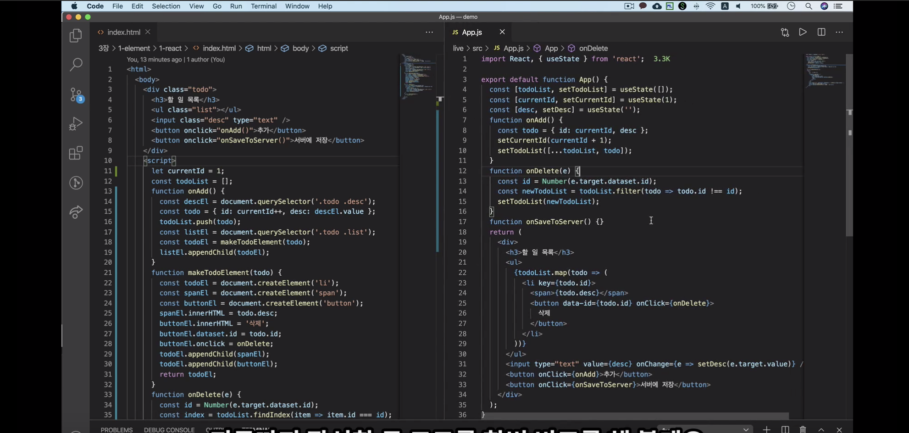

# 2.  중요하지만 헷갈리는 리액트 개념 이해하기
`$ npx create-react-app`명령어를 이용해 프로젝트 생성시 `npm ERR! cb() never called!`라는 에러가 발생했다. 이 에러 해결을 위해 [블로그](https://nightstudy.tistory.com/114)를 참고했다.
> `$ sudo npm cache verify`     
`$ sudo npm cache clean --force`      
후 다시 설치


## HTML코드와 React 코드를 비교해보자.


- 같은 코드를 작성했을 때, 리액트 코드는 이벤트 핸들러에서 데이터를 변경하는 작업만 하고있다. 반면에 html코드를 보면 데이터를 변경하는 코드도 있지만 UI코드도 섞여있는 것을 볼 수 있다.
>리액트에서는 비즈니스 로직과 UI코드가 분리되어 있다.
>즉, 리액트에서 UI코드는 jsx부분에서 한 번만 작성을 해주면 그 이후에는 신경쓰지 않아도 된다.
- html코드에서는 화면을 어떻게 그려야 하는지 자세하게 코드에 나와있지만, 리액트 코드에서는 화면에 무엇을 그리는지를 나타내고 있다. 데이터를 기반으로 UI가 어떤 모습이어야 하는지를 나타내는 것이다.
> html은 명령형 프로그래밍. 리액트는 선언형 프로그래밍
- html 코드는 처음 처음 시작은 보이지만 그 이후에 어떤 모습으로 UI가 변하는지 한눈에 보이지 않는다. 반면에 리액트 코드는 UI가 어떤 모습일지 한 눈에 보인다.
- html코드는 돔을 직접 수정하면서 화면을 어떻게 그리는지 구체적으로 나타낸다. 돔 api를 이용하고 있는 것인데, 상당히 구체적이기 때문에 돔 환경이 아닌 곳에서는 사용하기가 힘들다. 반면에 리액트 코드에서는 무엇을 그리는지만 나타내고 있기 때문에 다양한 방식으로 그릴 수 있다. 돔 환경뿐만 아니라 모바일 네이티브의 UI도 표현할 수 있는 것이다.
> 선언형 프로그래밍은 명령형 프로그래밍보다 추상화 단계가 높다고 할 수 있다. 추상화 단계가 높을수록 비지니스 로직에 조금 더 집중할 수 있다는 장점이 있다.

✔️ **리액트에서는 UI코드는 선언형으로 작성을 해놓고, 이벤트 핸들러에서는 데이터만 수정을 하게 되면 리액트가 자동으로 UI를 렌더링을 해준다.**

## 컴포넌트의 속성값과 상태값
리액트 컴포넌트에서는 UI데이터를 속성값이나 상태값으로 관리를 해야한다.

- 속성값이 변경될 때만 컴포넌트가 렌더링되게 하려면 `React.memo`를  사용하면 된다.

- 같은 컴포넌트를 여러 번 사용할 수도 있다. 같은 컴포넌트라고 하더라도 각각의 메모리 공간이 있기 때문에, 같은 컴포넌트를 여러번 사용해도 각각의 상태값을 유지할 수 있다.

- 속성값은 불변 변수이지만, 상태값은 불변 변수가 아니다. 하지만 상태값도 불변 변수로 관리하는 것이 좋다. 
	- 부모컴포넌트와 연결된 컴포넌트의 상태값을 수정하고 싶을 경우, 해당 값을 가진 부모 컴포넌트에서 관리하는 상태값 변경 함수를 이용해야 한다.
	- 불변 변수로 관리하면 코드의 복잡도도 낮아지는 장점이 있다.

- 객체를 불변 변수로 관리하는 방법은 **전개 연산자**를 이용하는 것이다.


## 컴포넌트 함수의 반환값
- 리액트 요소(`<div>`....), 문자열, 컴포넌트, 숫자, 배열 등을 반환이 가능하다.
```javascript
import React from 'react';
import Counter from './Counter';

function App() {
	return (
		<div>
			<Counter />
		</div>
	);
}

function App() {
	return <div>안녕하세요</div>;
}

function App() {
	return '안녕하세요'
}

function App() {
	return <Counter />;
}

function App() {
	return 123;
}

function App() {
	return ['안녕', '하세요'];
}

function App() {
	return [<p key={1}>안녕</p>, <p key={1}>하세요</p>];
}
// 배열로 반환할 때는 리액트 요소가 항상 key값을 갖고 있어야 한다.
// key는 렌더링을 효율적으로 하기 위해 필요한 값.

function App() {
	return (
		<React.Fragment>
			<p>안녕</p>
			<p>하세요</p>
		</React.Fragment>;
	)
}
// Fragment는 key값이 없어도 된다.
// 요소의 순서가 key역할을 하기 때문이다.
// 따라서, 여러개의 값을 반환할 때 유용하게 사용할 수 있다.

// Fragment는 축약형으로 입력할 수 있다.
function App() {
	return (
		<>
			<p>안녕</p>
			<p>하세요</p>
			{null}
			{false}
			{true}
		</>;
	)
}
// <> 속에 아무것도 입력하지 않으면 Fragment로 동작을 한다.
// 또한, null이나 boolean값들도 반환이 가능하다. 하지만 이 값들은 무시가 되어 화면에 출력되지 않는다.

export  default  App;
```
<br/>

**boolean**값은 **조건부 렌더링**을 할 때 유용하게 사용될 수 있다.
```javascript
{count.value  >  0  &&  <Title  title={`현재 카운트: ${count.value}`}  />}
```
- count.value > 0 && 를 줘서 조건만족시에만 렌더링이 되도록 해줬다.
- &&을 이용하면 조건부 렌더링이 된다. &&의 왼쪽에 있는 조건이 모두 만족되어야만 뒤에 있는 것이 렌더링된다.


### 리액트 portal 반환
컴포넌트에서는 리액트 portal을 반환할 수가 있다.
- `public` - `index.html`파일의 `<div id="root"></div>`외에도 다른 <div>로 연결이 가능하다.
- 리액트 protal을 하기 위해서는 react-dom에 있는 함수를 사용해야 한다.

```html
<!-- index.html -->

<div  id="something"></div>
```
```javascript
// App.js

import React from  'react';
import ReactDOM from  'react-dom';
import Counter from  './Counter';

function  App() {
	return (
		<>
			<p>안녕</p>
			<Counter  />
			{ReactDOM.createPortal(
				<div>
					<p>안녕하세요</p>
					<p>리액트 portal을 연습하고 있습니다.</p>
				</div>,
			document.getElementById('something'),
			)}
		</>
	);
}

export  default  App;
```


## 리액트 요소와 가상돔
- 리액트 요소는 리액트가 UI를 표현하는 수단이다.
- 리액트 요소는 변경할 수 없다.
<br/>

- 리액트 요소로부터 가상돔을 만들고 실제 돔에 반영할 변경사항을 따라가보자.
- 컴포넌트의 key를 변경하게 되면 해당 컴포넌트는 삭제됬다가 다시 추가된다. 컴포넌트가 삭제되는 것을 unmount, 추가되는 것을 mount라고 한다.
```javascript
// 예시코드 
// Counter는 Counter.js, seconds는 이 코드에는 적지않았지만 실제로는 위에서 const [seconds, setSeconds] = useState(0);이라고 선언해준 변수임.
<Counter key={seconds} />
<h1 stype={{color: seconds % 2 ? 'red' : 'blue'}}></h1>
// 조건부 렌더링으로도 비슷한 효과를 볼 수 있다.
{seconds % 2 === 0 && <Counter />
```

***
- 하나의 화면을 표현하기 위해서 여러 개의 리액트 요소가 트리구조로 표현이 된다. 하나의 리액트 요소 트리는 시간에 따라 변화하는 화면의 한 요소를 나타낸다고 볼 수 있다.
- 리액트는 이전의 가상돔과 달라진 부분만 실제돔에 반영한다. 브라우저에서 실제 돔을 변경하는 작업은 다소 시간이 걸린다. 따라서 꼭 필요한 부분만 변경하는 것이 중요하다. 이러한 작업을 리액트가 내부적으로 알아서 해주는 것이다.


## 리액트 훅 기초 익히기
### 리액트 훅(hook)
컴포넌트에 기능을 추가할 때 사용하는 함수.
- 컴포넌트의 상태값 추가, 자식요소에 접근 등...
- 리액트 16.8에 새로 추가된 기능이다.
	- 이전에는 클래스형 컴포넌트를 사용했다. 
	- 클래스형 컴포넌트보다 장점이 많으며 리액트 팀에서도 훅에 집중하고 있다.
- 리액트에서 제공하는 대표적인 두 가지 훅
	- useState: 상태값 추가
	- useEffet: 부수효과 처리
		- 부수효과는 외부의 상태를 변경하는 것을 말한다. 서버 API를 호출하거나 이벤트 핸들러를 등록하는 것 등이 있다.
***

- 상태값 변경함수는 비동기이면서 배치(batch)로 처리된다. 리액트는 효율적으로 렌더링하기 위해서 여려 개의 상태값 변경 요청을 배치로 처리한다.
- 상대값 변경함수를 비동기, 배치로 처리하는 이유는?
	- 만약, 상태값 변경함수를 동기로 처리하면 하나의 상태값 변경 함수가 호출될 때마다 화면을 다시 그리기 때문에 성능 이슈가 발생할 수 있다.
	- 만약, 상태값 변경은 동기로 처리하고 화면은 매번 다시 그리지 않는다면  UI데이터와 화면과의 불일치가 발생해 혼란해진다.
- `batchedUpdates()`라는 함수를 호출하면 외부에서 처리될 때도 batch로 처리되게 할 수 있다.
- 상태값 변경 함수는 호출한 순서대로 적용된다. 하지만 batch로 적용이 될 때는 순서 정보가 의미없어 진다.
***

여러개의 상태값을 하나의 `useState`로 관리할 수 있다.
- 상태값 변경 함수를 호출할 때는 전체 객체를 새로 입력해줘야 한다. 변경할 값은 뒤에 입력해주고, 앞에는 `...`이 필요하다.
```javascript
onChange={e => setState({...state, name: e.target.value})}
```
***

`useEffect`
- 특별한 이유가 없다면 모든 부수효과는 `useEffect`에서 작업하는 것이 좋다.
- 렌더링 결과가 실제 돔에 반영된 후에 부수효과 함수가 비동기로 호출이 된다. 
- 하지만 렌더링이 자주 발생한다면 그때마다 api를 호출하는 것은 비효율적이다. 그럴 경우, 의존성 배열을 통해 해당 배열의 값이 변경될 때만 부수효과 함수가 실행되도록 하면 된다.
	- 외부 함수는 의존성 배열에 입력할 필요가 없지만, 지역함수를 부수 효과 함수 내부에서 사용했다면 의존성 배열에 입력해줘야 한다.
	- 의존성 배열의 값이 항상 변경된다고 볼 수 있는데, `useCallback`이라는 훅을 이용해서 메모리제이션 기능을 이용하면 된다. 
	- 의존성 배열은 꼭 필요한 경우에만 입력하는 것이 좋다. 예를 들어 새로운 상태값을 추가한 다음에 부수효과 함수에서 사용하면, 매번 사용한 변수를 의존성 배열에 추가해야하는 번거로움이 있는데, `useEffect`훅을  사용할 때 많은 버그가 의존성 배열을 잘못 사용하면서 발생하게 된다.
- 부수효과가 반환하는 값
	- 부수효과에서 반환하는 함수는 다음 부수효과 함수가 호출되기 직전, 또는 컴포넌트가 unmount되기 직전(사라지기 직전)에 적어도 한 번은 호출된다.
	- 의존성 배열로 빈 배열을 입력하면 컴포넌트가 생성될 때만 부수효과 함수가 호출되고, 컴포넌트가 사라질 때만 반환하는 함수가 호출된다. 

## 훅 직접 만들기
- 새로운 훅을 직접 만들어 사용할 수 있으며, 재사용성이 좋다는 점이 훅의 가장 큰 장점이다.
- 훅으로 분리하면 직관적이고 간편하다.
- 현업에서 사용할 수 있는 훅을 생각해보면, 로그인을 한 사용자일 경우에만 접근할 수 있도록 하는 훅, 어떤 페이지에서 사용자가 작성한 내용이 있을 때 저장하지 않고 벗어나려할 경우 알림창을 보여주는 훅, useEffect를 실행하는데 로그인 유저인 경우에만 실행하도록 하는 훅 등의 경우에 사용할 수 있겠다.

## 훅 사용 시 지켜야 할 규칙
> 1️⃣ 하나의 컴포넌트에서 훅을 호출하는 순서는 같아야한다.   
> 2️⃣ 훅은 함수형 컴포넌트 또는 커스텀 훅 안에서만 호출되어야 한다.

위 규칙들을 지켜야 리액트가 각 훅의 상태를 제대로 기억할 수 있다.
좀 더 자세히 살펴보자.

### 1️⃣ 하나의 컴포넌트에서 훅을 호출하는 순서는 같아야한다.
- if문 안에서 훅을 사용하면 안된다. 어쩔 때는 한 번사용했다가 어쩔 때는 두 번 사용했다가 할 수 있기 때문이다.
- for문 안에서 훅을 사용하면 한된다. 밸류에 따라 useState를 사용하는 횟수가 달라지기 때문이다.
- 함수 안에서도 훅을 호출하면 안된다. 함수의 사용여부에 따라 호출이 되었다 안되었다 할수 있기 때문이다.
- 사용자가 없을 

### 2️⃣ 훅은 함수형 컴포넌트 또는 커스텀 훅 안에서만 호출되어야 한다.
- 훅 함수 안에서 데이터를 만들어서 hooks에 넣을 때, 순서대로 차곡차곡 쌓이게 된다. 해당 훅의 index는 변하지 않게 된다. 이런 방식으로 리액트 내부에서는 각 훅이 사용된 위치 정보를 기반으로 훅 데이터를 관리한다.

